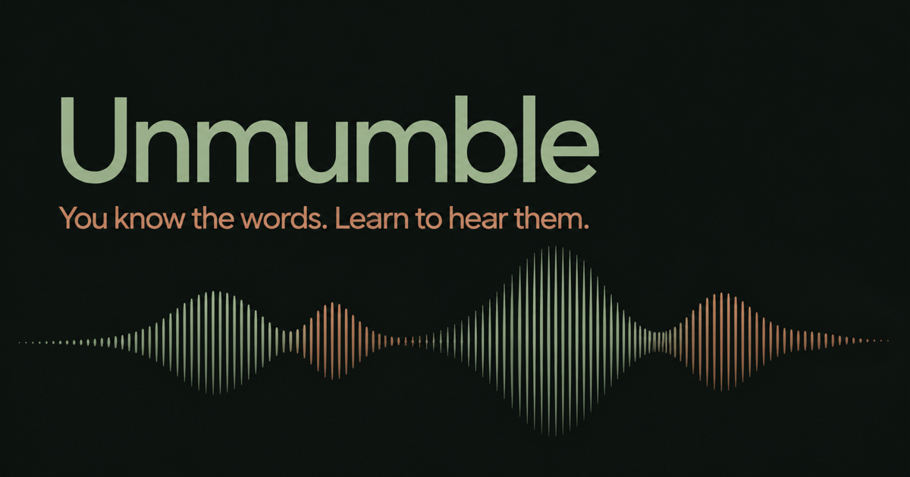

# Unmumble



**Hear the words you already know.**

[**Try the hosted beta**](https://unmumble.online)
· [Run locally](#run-locally)
· [Self-host](#self-hosting)

> [!NOTE]
> **Beta:** Unmumble is under active development. Features, data formats, and
> deployment details may change while the product is being tested.

Unmumble is a connected-speech trainer for English learners. It helps turn
what sounds like one long stream of sound into words you can recognize, using
real examples from YouGlish and Tatoeba.

## Why Unmumble

Knowing a word does not always mean you can hear it in natural speech. Common
words join together, become shorter, change, or disappear. Unmumble gives you
a focused loop for closing that gap:

1. Listen to a real example.
2. Check the words in the captions.
3. Slow it down and repeat it.
4. Listen again without reading.

## What you can do

- **Library** — explore hard-to-hear phrases organized by connected-speech
  pattern.
- **Practice** — choose a phrase, listen to real examples, reveal captions,
  slow playback, and repeat.
- **Videos** — save YouTube videos and continue from a remembered position.
- **Settings** — manage account data and optional integrations.

You can use the core learning flow without an account. Guest progress stays in
the current browser. Signing in with Google stores account progress in
Cloudflare D1 so it can be restored across sessions.

## Thank you, YouGlish

The core listening experience in Unmumble is built around real spoken-English
examples made available through [YouGlish](https://youglish.com). Its widget
makes it possible to hear phrases across authentic videos, speakers, and
accents, then practice them in context.

A huge thank-you to the YouGlish team for making this kind of listening practice
possible.

Unmumble is an independent project and is not affiliated with or endorsed by
YouGlish.

## Try Unmumble

The project has a hosted version at
**[unmumble.online](https://unmumble.online)**. It is the fastest way to try
the current beta and does not require a local installation.

The hosted beta is intended for testing and feedback. If you prefer to inspect
the code or control the infrastructure, run it locally or deploy your own
Cloudflare Worker.

## Run locally

### Requirements

- Node.js 22.13 or newer
- npm

### Setup

```bash
git clone https://github.com/koreyba/Unmumble.git
cd Unmumble
npm ci
npx wrangler d1 migrations apply DB --local --config wrangler.jsonc
npm run dev
```

Open the local URL printed by Vite. The `--local` migration command initializes
a local D1 database and does not modify the hosted preview or production
databases.

Guest mode works locally without Cloudflare Access. Google sign-in and
server-side integrations require additional Cloudflare configuration.

## Beta feedback

Every application page and the standalone trainer load the small Feedback
widget. A valid report is saved to D1 first; Telegram delivery runs in the
background and cannot make the stored report disappear.

Reports may include JPEG, PNG, or WebP images up to 5 MB, limited to one optional
image per report. Images are not stored in D1: they are passed directly to Telegram on a best-effort basis.
If Telegram rejects an image, the stored text report is still sent without it.
The public endpoint is limited to 5 requests per client and 50 requests per
Worker location each minute.

Apply migrations before testing locally:

```bash
npx wrangler d1 migrations apply DB --local --config wrangler.jsonc
```

Telegram is optional. Without its two secrets, reports remain in D1 with the
`not_configured` delivery status. To enable notifications, create a bot with
BotFather, send that bot a message, find the destination chat ID, and set both
values as Worker secrets for the target environment:

```bash
npx wrangler secret put TELEGRAM_BOT_TOKEN --config wrangler.preview.jsonc
npx wrangler secret put TELEGRAM_CHAT_ID --config wrangler.preview.jsonc
```

Use `wrangler.production.jsonc` instead when configuring production. Never put
the bot token in source code, Wrangler vars, screenshots, or logs.

### Large-list demo data

Create deterministic local-only catalog data for Library and a matching guest
state file for a large Practice list:

```bash
npm run demo:seed-practice -- 200
npm run dev
```

The command always uses Wrangler's `--local` D1 database. It adds namespaced
`demo-virtual-*` rows and writes the reusable guest state to
`.wrangler/practice-demo-guest-state.json`. Remove only those fixture rows with:

```bash
npm run demo:reset-practice
```

## Self-hosting

Unmumble is a web application rather than an installable npm package. The
reference deployment uses Cloudflare Workers, static assets, and D1.

> [!IMPORTANT]
> The checked-in Wrangler files contain the maintainers' Worker names, database
> identifiers, Access audience, and domain. Replace those values before
> deploying a fork. Also review the [License](#license) section before using the
> code beyond local evaluation.

### 1. Create your Cloudflare resources

```bash
npx wrangler login
npx wrangler d1 create your-unmumble-db
```

Update `wrangler.production.jsonc` with your own:

- Worker name;
- D1 database name and ID, keeping the binding name `DB`;
- custom domain or Workers.dev preference;
- `ACCESS_TEAM_DOMAIN` and `ACCESS_AUD` if you want Google sign-in through
  Cloudflare Access.

### 2. Configure optional secrets

The core guest experience does not require provider secrets. To store optional
integration credentials, configure a private 32-byte base64url encryption key:

```bash
npx wrangler secret put INTEGRATIONS_ENCRYPTION_KEY \
  --config wrangler.production.jsonc
```

Never commit the encryption key or provider API keys.

### 3. Migrate and deploy

```bash
npm run build
npx wrangler d1 migrations apply your-unmumble-db \
  --remote \
  --config wrangler.production.jsonc
npx wrangler deploy --config wrangler.production.jsonc
```

The repository's `npm run deploy:*` scripts are deliberately pinned to the
maintainers' preview and production environments. Review and adapt those
safeguards before using them in a fork.

## Architecture

- **Application:** React and Next.js App Router, built for Cloudflare with
  vinext and Vite.
- **Runtime:** Cloudflare Worker serving application routes, APIs, and static
  assets.
- **Storage:** Cloudflare D1 with append-only Drizzle migrations.
- **Authentication:** optional Google sign-in through Cloudflare Access and an
  application session.
- **Learning sources:** YouGlish and Tatoeba; DeepL is an optional signed-in
  integration.

Guest state is stored in browser storage. Signed-in phrases, examples, videos,
progress, sessions, and encrypted integration credentials are stored in D1.

## Development

- `npm run dev` — start the local development server.
- `npm run build` — create a verified production build.
- `npm test` — build the application and run the complete test suite.
- `npm run test:worker` — run D1 lifecycle tests inside the Cloudflare Workers runtime.
- `npm run test:e2e` — run desktop and mobile chat recovery journeys in Chromium.
- `npm run lint` — run ESLint.
- `npm run db:generate` — generate a Drizzle migration from schema changes.

Detailed requirements, design decisions, implementation notes, and test plans
live under [`docs/ai`](./docs/ai).

## Feedback and contributing

Beta feedback and focused pull requests are welcome.

Maintained by [@koreyba](https://github.com/koreyba).

1. Search the existing
   [issues](https://github.com/koreyba/Unmumble/issues).
2. Open an issue before a large product or architecture change.
3. Keep changes focused and add or update tests for changed behavior.
4. Run `npm test` and `npm run lint` before opening a pull request.

When reporting a bug, include the affected page, expected behavior, actual
behavior, and reproduction steps. Do not include API keys, authentication
tokens, or private learning data.

## License

Unmumble is developed in public and is intended to be open source. The
repository does not yet include a license, so permission to use, modify, or
redistribute the code has not been formally granted. A license must be selected
before the project can accurately describe itself as open source.
