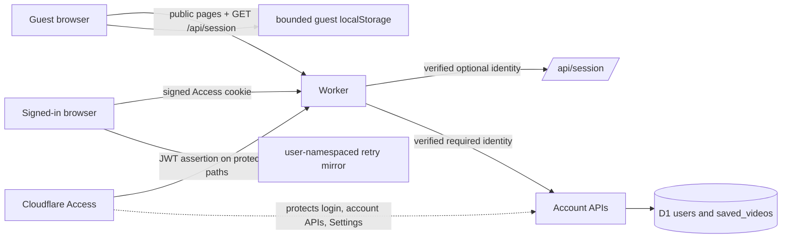

# Authentication Session and Video Persistence Design

## Architecture Overview



- `worker/index.ts` remains the trust boundary. It strips client identity headers, validates Access JWT issuer/audience/signature/expiry, and accepts `CF_Authorization` as an optional browser token only after that same verification.
- A public `GET /api/session` returns verified session metadata or `{ user: null }` with `Cache-Control: no-store`. It does not authorize D1 operations.
- Public clients always probe the session endpoint, then choose guest-local or account-API data. The old local auth hint is removed as an authority.
- Account video APIs remain fail-closed and subject-scoped. Cloudflare Access must add `/api/videos` to the existing account application paths so the Worker receives an assertion.
- The trainer writes local progress immediately, throttles D1 synchronization, and flushes changed account progress on meaningful exit/pause events.

## Data Models

`saved_videos` keeps one row per `(user_id, youtube_video_id)` and adds:

```text
resume_seconds        REAL NOT NULL DEFAULT 0
resume_caption_id     TEXT NOT NULL DEFAULT ''
resume_caption_text   TEXT NOT NULL DEFAULT ''
progress_updated_at   TEXT NULL
```

- `resume_seconds` is bounded to the existing seven-day maximum and is display/warm-resume metadata, not a promise of exact cold seeking.
- `resume_caption_id` and `resume_caption_text` store only the last observed caption anchor. No full transcript is stored.
- `progress_updated_at` is server-generated when valid progress is written and lets clients compare D1 with their same-account retry mirror.
- `updated_at` continues to order Continue Watching by recent deliberate viewing/progress activity; `created_at` is stable.
- Existing unique and user-updated indexes remain sufficient.

Client progress keys become mode/user-specific:

```text
guest:   listen-to-learn-youtube-progress-v1:anonymous
account: listen-to-learn-youtube-progress-v1:<encoded Access subject>
```

The account key is a bounded retry/warm-navigation mirror. D1 is the cross-browser source of truth.

## API Design

### `GET /api/session` — public optional identity

Response, always `200` and `no-store`:

```json
{ "user": null }
```

or:

```json
{ "user": { "id": "verified-sub", "email": "...", "name": "..." } }
```

The endpoint accepts identity only from a verified Access assertion/application cookie. It never ensures a D1 user or returns account data.

### `GET /api/videos` — protected

Returns subject-owned history including the four resume fields. Values are normalized before reaching the browser.

### `POST /api/videos` — protected idempotent upsert

Existing origin fields remain required. An optional `progress` object carries:

```json
{
  "seconds": 123.4,
  "captionId": "bounded-id",
  "captionText": "last observed bounded caption"
}
```

The route validates all origin/progress fields first, then performs one subject-scoped upsert. Missing progress preserves existing resume fields; valid progress updates resume fields and server timestamps. The initial `Continue in video` write includes the current progress, eliminating create/update races.

### `DELETE /api/videos?id=...` — protected

Unchanged ownership rule: delete only `(id, current subject)`; local retry progress for that account/video is also cleared in the client after success.

### Login/logout

- `/login?returnTo=/videos` remains protected. After verified Access authentication, the Worker redirects only to an allowlisted public app path (`/`, `/practice`, `/videos`, `/trainer` with safe bounded query where required) and appends `signedIn=1`.
- Sign out uses `/<application>/cdn-cgi/access/logout`. Client account state is cleared before navigation; subsequent API access still requires a verified Access token.

## Component Breakdown

- `worker/index.ts`: token extraction/verification, optional session response, protected request propagation, safe login return target.
- `lib/guest-access.ts`: public route classification and safe `returnTo` normalization.
- `lib/client-session.ts`: shared browser session response types/probe and account progress key construction for React clients.
- `app/components/phrase-workspace.tsx`: Library/Practice session bootstrap and consistent account action.
- `app/videos/page.tsx`: session bootstrap, D1 history/resume in account mode, local history/resume in guest mode.
- `app/integrations/page.tsx`: protected Settings action with consistent Sign out wording.
- `public/trainer.html`: session bootstrap, user-namespaced local mirror, throttled account progress upsert/flush.
- `app/api/videos/route.ts`: progress validation and subject-scoped round-trip.
- `db/schema.ts` plus a new numbered Drizzle migration: resume columns.
- Cloudflare Access account application: add exact `/api/videos` destination while preserving existing policy/audience.

## Design Decisions

### Chosen: public optional-session endpoint backed by verified Access tokens

This makes the server session authoritative without forcing public pages behind Access. A browser cookie is not trusted as an ordinary cookie; it is treated as an alternate carrier for the same signed JWT and receives full `jose` verification.

### Rejected: keep the `localStorage` auth hint and patch individual pages

Fast for guests, but cannot distinguish stale/missing hints, login through Settings, another tab, token expiry, or logout consistently. It caused the current defect.

### Rejected: protect every UI page with Access

It would make session detection trivial but violates the explicit public-product requirement.

### Chosen: retain the two current Access applications

Live API readback shows one account application for `/login` and the main account APIs and one Settings application for `/integrations` and `/api/integrations`. Both use a 24-hour session, an `allow everyone` policy constrained by the configured Google IdP, domain-scoped HttpOnly authorization cookies, and distinct audiences already accepted by the production Worker. Branch preview aliases are protected by a third `preview_worker` Access application, so only the preview Worker configuration accepts that additional audience. This feature adds `/api/videos` to the account application but does not merge or delete Access applications. Cross-application navigation remains a required live smoke.

Merging the applications was considered because one audience is simpler, but it would require a destructive policy/application migration unrelated to the proven defect. Keeping both preserves the current Settings boundary and rollback path.

### Chosen: extend the existing idempotent video upsert

One endpoint owns both the history record and its last resume anchor. This avoids a POST/PATCH race on first entry and preserves current subject scoping/deduplication.

### Chosen: immediate local mirror plus throttled D1 writes

Local writes preserve responsive warm navigation. A trailing account sync at most every 15 seconds plus event flush bounds D1 volume while making cross-browser resume useful. Full observed-caption history and UI preferences stay local.

### Rejected: write every caption callback to D1

It produces unnecessary write amplification and couples storage load to provider callback frequency.

## Non-Functional Requirements

- Session and account responses are `no-store`; public documents keep their existing cache behavior.
- JWTs, cookies, subjects, emails, caption text, queries, and progress bodies are never logged.
- All account SQL includes the verified subject; guest requests perform zero D1 writes.
- Session failure degrades to guest without redirect loops or page failure.
- Progress requests remain below the Fetch keepalive body limit and are bounded by current payload limits.
- Cross-device resume can lag continuous playback by at most the throttle window unless the final flush fails; the UI must not claim a successful server save after an error.
- Migration is additive and backward-compatible. Rollback code tolerates the new columns remaining in D1.
- Rollout order is migration, Worker/API code, Access `/api/videos` destination update, then authenticated smoke. Do not report D1 persistence before all four are verified.
