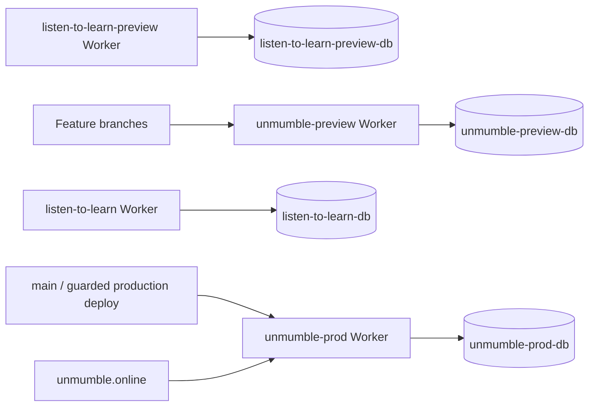

# Unmumble Blue-Green Migration Design

## Architecture

The old and new stacks share no D1 binding. `unmumble-preview` receives branch
versions without moving production traffic. `unmumble-prod` serves the custom
domain and remains protected by the guarded production deploy command.

## Data-copy design

The Wrangler full export places `phrases` rows before creation of the referenced
`users` table, so a direct import into an empty D1 fails safely. The supported
copy flow is:

1. Apply repository migrations to the empty target D1.
2. Clear migration seed data from target application tables while retaining
   `d1_migrations`.
3. Export source application tables as data-only SQL.
4. Import tables in dependency order: users, phrases, then dependent tables.
5. Compare migration state, table counts, and foreign-key checks.

## Configuration

- `wrangler.preview.jsonc` targets `unmumble-preview` and
  `unmumble-preview-db`.
- `wrangler.production.jsonc` targets `unmumble-prod`, `unmumble-prod-db`, and
  the `unmumble.online` Custom Domain.
- `wrangler.jsonc` mirrors those production and preview targets for Cloudflare
  Builds after repository cutover.
- `scripts/deploy-worker.mjs` keeps target names pinned and production opt-in.

## Security and reliability

- Exports live only in a mode-0700 temporary directory and are not committed.
- No secret is copied through CLI output or configuration files.
- Branch-preview URLs use a preview-only Worker Access application.
- Production temporarily uses Worker-wide Access because the site has one user;
  route-level guest access is revisited with the Google-auth merge.
- Each Worker has a distinct fresh encryption key, so compromise or reset of one
  environment does not expose the other.
- Old resources are not mutated as part of validation.
