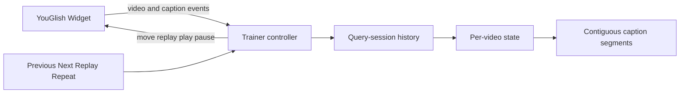

# System Design & Architecture

## Architecture Overview



`public/trainer.html` remains the provider controller. The pure helper in
`public/caption-navigation.js` owns segment placement and segment-scoped neighbor
selection so the state rules are deterministic and independently testable.

## Data Models

```ts
type CaptionEntry = {
  videoId: string;
  id: string;
  raw: string;
  text: string;
  startTime: number | null;
  navigationMode: "seek" | "replay";
  segmentId: string;
  firstSeen: number;
  observedAt: number;
  lastKnownTime?: number | null;
  nextOffsetSeconds?: number | null;
  nextOffsetTargetId?: string;
  playbackContinuity?: number;
};

type VideoCaptionState = {
  history: CaptionEntry[];
  index: number;
  activeSegmentId: string;
  nextEntrySequence: number;
  nextSegmentSequence: number;
};
```

The controller keeps `Map<videoId, VideoCaptionState>` for the active query
session. A new phrase/query/source/example context clears the map; a video event
only switches the active state.

## API Design

No network or database API changes are needed. The helper API is extended to:

- select an existing segment by known caption ID;
- place a time inside a known segment range;
- extend a nearby active segment or create a new segment for a distant gap;
- return adjacent captions only when their `segmentId` matches;
- report the active segment size/range for UI state.

## Component Breakdown

### Per-video session cache

`onVideoChange` saves the active state and loads the state for the new video ID.
The same ID is idempotent. Query/source changes clear the whole session cache.

### Segment resolver

Resolution order is:

1. Existing caption ID selects its stored segment.
2. A new timestamp inside an existing segment range joins that segment.
3. A new timestamp close to the active boundary extends the active segment.
4. A distant timestamp creates a new active segment.

The boundary tolerance is deliberately conservative (`30` seconds). A false
split disables a jump; a false merge can create a harmful large jump. Automatic
segment merging is deliberately deferred: known IDs and contained timestamps
reactivate their existing segment without rewriting previously captured state.

### Replay synchronization

Replay records whether playback was paused. A same-video provider callback loads
the existing video state instead of clearing it. The first caption callback sets
the active index and segment. If Replay auto-starts playback after a paused
request, the controller pauses again after the target is confirmed.

For a replay-only first caption without a timestamp, Next remains available. A
direct `move` is used only with a valid current time; otherwise the controller
plays toward the already known next caption ID and restores the prior paused
state when that caption arrives. The navigation intent survives transient
`PAUSED`, `BUFFERING`, and `PLAYING` callbacks caused by provider commands; only
the target caption, explicit Replay cancellation, a video change, a provider
error, or a 20-second timeout completes it. If playback is already running, the
controller waits without issuing pause/play churn. No extra visible navigation
status is rendered while waiting.

User play/pause commands record the requested playback state separately from
the last provider callback. This prevents a late `PLAYING` callback from
overwriting an explicit pause before controlled Next restores that pause at its
target. An explicit user Pause during an already-running controlled Next cancels
that target immediately, so a later Next click can start a fresh attempt rather
than waiting for the timeout.

## Design Decisions

- Retain segments instead of deleting history after a manual seek.
- Scope navigation to an active segment, not the entire sorted video history.
- Cache per video only within the current query session to avoid mixing the same
  YouTube video opened for different search phrases.
- Prefer provider events and known IDs over caption text or numeric ID ordering.
- Keep the implementation client-only and fail closed when an exact target
  cannot be confirmed.
- Clear pending controlled-playback or Replay intent when the widget rejects a
  command so a later unrelated caption event cannot complete a stale action.
- Treat provider player-state callbacks as observations, not acknowledgements
  that can cancel a newer caption-navigation intent.
- Keep Replay available during controlled Next; Replay explicitly cancels that
  intent and returns to the first observed caption.

Rejected alternatives: clearing all history on every seek, one flat per-video
timeline, scraping the iframe, fixed five-second movement, or deriving a Replay
seek from measured caption duration. Live provider tests showed that `move()` is
relative to the widget playhead rather than the virtual Replay caption: a
duration-based move skipped the known next caption, while a delta derived from
the Replay callback cursor preserved the target but did not shorten playback.
The public Widget API exposes no absolute seek or current-position getter.

### Symmetric untimed-edge navigation

The rejected experiment attempted a forward seek after provider Replay. The new
best-effort path instead learns a clean, uninterrupted media-time edge `A -> B`
and uses it symmetrically: `move(-d)` returns from B to untimed A and `move(+d)`
returns from A to B. Elapsed playback inside the current caption is added or
subtracted from the command, and playback speed converts wall time to media
time. A player-state discontinuity discards the previous interval; if playback
returns to `PLAYING` while untimed A is still current, measurement restarts from
that playhead. Pausing without a subsequent resume, video switching, missing
measurements, or an edge outside the 30-second segment tolerance retain the
existing Replay/controlled-playback fallback.

The learned edge is navigation metadata only. It never supplies `startTime`,
changes history order, changes segment membership, or controls whether a cached
Next neighbor exists. Each edge is bound to the ID of the neighbor it measured,
so later insertion of another cached caption invalidates its use. Provider
callbacks still confirm the requested caption.

## Non-Functional Requirements

- No polling while idle and no unbounded timers.
- One navigation command in flight at a time.
- No new secrets, endpoints, storage, or cross-origin iframe access.
- Tatoeba behavior and whole-video YouGlish navigation remain unchanged.
- All icon button labels and disabled states remain accessible.
