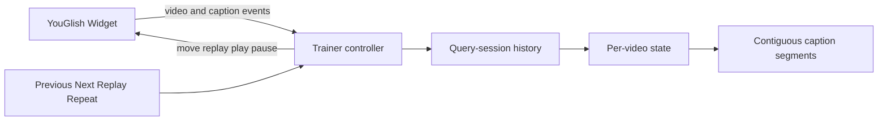

# System Design & Architecture

## Architecture Overview



`public/trainer.html` remains the provider controller. The pure helper in
`public/caption-navigation.js` owns segment placement and segment-scoped neighbor
selection so the state rules are deterministic and independently testable.

## Data Models

```ts
type CaptionEntry = {
  videoId: string;
  id: string;
  raw: string;
  text: string;
  startTime: number | null;
  navigationMode: "seek" | "replay";
  segmentId: string;
  firstSeen: number;
  observedAt: number;
  lastKnownTime?: number | null;
};

type VideoCaptionState = {
  history: CaptionEntry[];
  index: number;
  activeSegmentId: string;
  nextEntrySequence: number;
  nextSegmentSequence: number;
};
```

The controller keeps `Map<videoId, VideoCaptionState>` for the active query
session. A new phrase/query/source/example context clears the map; a video event
only switches the active state.

## API Design

No network or database API changes are needed. The helper API is extended to:

- select an existing segment by known caption ID;
- place a time inside a known segment range;
- extend a nearby active segment or create a new segment for a distant gap;
- return adjacent captions only when their `segmentId` matches;
- report the active segment size/range for UI state.

## Component Breakdown

### Per-video session cache

`onVideoChange` saves the active state and loads the state for the new video ID.
The same ID is idempotent. Query/source changes clear the whole session cache.

### Segment resolver

Resolution order is:

1. Existing caption ID selects its stored segment.
2. A new timestamp inside an existing segment range joins that segment.
3. A new timestamp close to the active boundary extends the active segment.
4. A distant timestamp creates a new active segment.

The boundary tolerance is deliberately conservative (`30` seconds). A false
split disables a jump; a false merge can create a harmful large jump. Automatic
segment merging is deliberately deferred: known IDs and contained timestamps
reactivate their existing segment without rewriting previously captured state.

### Replay synchronization

Replay records whether playback was paused. A same-video provider callback loads
the existing video state instead of clearing it. The first caption callback sets
the active index and segment. If Replay auto-starts playback after a paused
request, the controller pauses again after the target is confirmed.

For a replay-only first caption without a timestamp, Next remains available. A
direct `move` is used only with a valid current time; otherwise the controller
plays toward the already known next caption ID and restores the prior paused
state when that caption arrives.

## Design Decisions

- Retain segments instead of deleting history after a manual seek.
- Scope navigation to an active segment, not the entire sorted video history.
- Cache per video only within the current query session to avoid mixing the same
  YouTube video opened for different search phrases.
- Prefer provider events and known IDs over caption text or numeric ID ordering.
- Keep the implementation client-only and fail closed when an exact target
  cannot be confirmed.
- Clear pending controlled-playback or Replay intent when the widget rejects a
  command so a later unrelated caption event cannot complete a stale action.

Rejected alternatives: clearing all history on every seek, one flat per-video
timeline, scraping the iframe, or fixed five-second movement.

## Non-Functional Requirements

- No polling while idle and no unbounded timers.
- One navigation command in flight at a time.
- No new secrets, endpoints, storage, or cross-origin iframe access.
- Tatoeba behavior and whole-video YouGlish navigation remain unchanged.
- All icon button labels and disabled states remain accessible.
