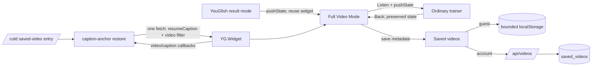
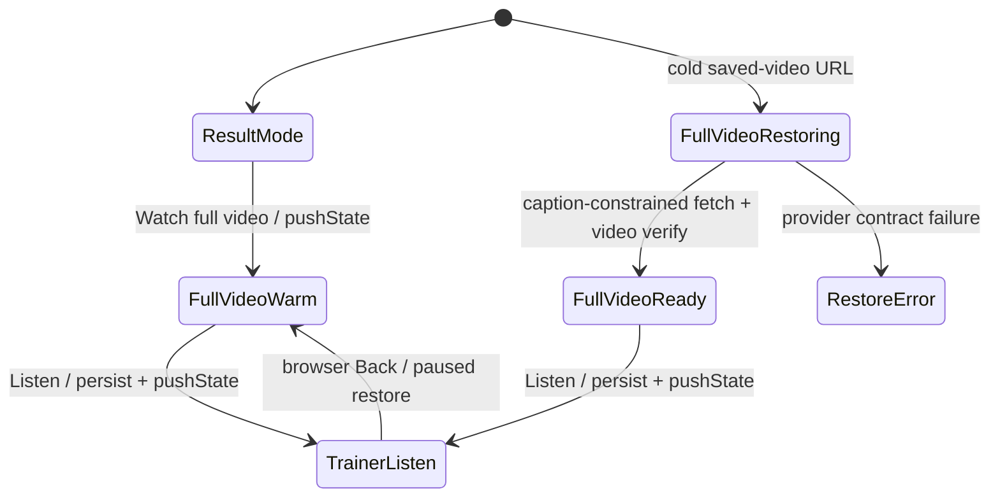

# YouGlish Full Video Mode Design

## Revision Status

Revision 2 replaces the direct `YT.Player` architecture. Existing persistence/API work may be reused after schema reconciliation, but the native-player UI is not the accepted playback design.

## Architecture Overview



Full Video Mode is a distinct application mode, not a third search provider and not a separate native YouTube player. The same trainer document owns the YouGlish widget, caption state, learning controls and browser history. A warm transition changes view state without destroying the widget. A cold `/videos` entry initializes the same shell and performs one controlled restore fetch.

## Chosen Design and Alternatives

- **Chosen: shared YouGlish widget in one trainer shell.** Preserves current captions and learning controls, enables zero-fetch warm transitions, and makes Back restoration possible without rebuilding provider state.
- **Rejected: official native YouTube IFrame.** Supports playback/resume but does not expose caption text to ListenToLearn, so Repeat/Translate/To learn/Listen cannot work.
- **Rejected: unofficial YouTube caption extraction.** Violates the agreed provider/policy boundary and creates a brittle dependency.
- **Rejected: free transcript aggregator.** No verified free, licensed arbitrary-video provider meets the requirement.
- **Rejected: separate full-page YouGlish widget for every transition.** It would turn a warm transition and Back into extra searches and lose live widget state.

## Application Modes and History



History entries contain application mode/URL metadata, not a serialized widget. `popstate` restores application state. Before leaving Full Video Mode, the controller pauses and synchronously records the latest known caption/time. Back from Listen uses the caption-level cold restore because Listen reused the widget for another query; Back from a warm Full Video transition to its source result needs no fetch.

Direct page reload cannot preserve a JavaScript widget. It follows the cold restore path and consumes one fetch.

## Components

### Trainer shell / mode router

- Owns the single `YG.Widget` lifecycle.
- Maps `/trainer` history states to Result, Full Video and Listen modes; `/videos` remains the saved-video library.
- Uses `history.pushState` for in-document transitions and `popstate` for Back/Forward.
- Rejects a returned video ID that differs from the saved target.

### Saved-video repository

- Reuses guest/account persistence boundaries.
- Deduplicates by `videoId`.
- Stores the exact source query and provider options needed for a cold restore.
- Keeps progress browser-local and separate from the account bookmark record.

### Full-video controller

- Adapts the existing YouGlish callback stream into current caption, observed history, time, playback and restore state.
- Exposes only the approved Full Video controls.
- Never fetches because playback crosses a caption boundary.
- Keeps bounded observed-caption history; it does not build or persist a full transcript.

### Restore orchestrator

- Runs only when no reusable matching widget is alive.
- Starts the widget with autoplay disabled and restores via a caption-constrained query.
- Limits one restore attempt to one fetch.
- Rejects unavailable metadata/wrong video and leaves provider/quota errors visible.

## Data Models

### Account bookmark

```text
saved_videos
  id TEXT PRIMARY KEY
  user_id TEXT NOT NULL REFERENCES users(id) ON DELETE CASCADE
  youtube_video_id TEXT NOT NULL
  origin_query TEXT NOT NULL
  language TEXT NOT NULL DEFAULT 'english'
  accent TEXT NOT NULL DEFAULT ''
  origin_phrase_id TEXT NULL REFERENCES phrases(id) ON DELETE SET NULL
  origin_caption TEXT NOT NULL DEFAULT ''
  created_at TEXT NOT NULL
  updated_at TEXT NOT NULL
  UNIQUE(user_id, youtube_video_id)
```

The existing migration must be reconciled additively. Existing rows without a usable query are legacy-unrestorable and must show a clear fallback rather than issue an invented fetch.

### Guest bookmark

```ts
type SavedVideo = {
  id: string;
  videoId: string;
  originalQuery: string;
  language: string;
  accent?: string;
  originPhraseId?: string;
  originCaption?: string;
  createdAt: number;
  updatedAt: number;
};
```

### Browser-local runtime/progress

```ts
type VideoProgress = {
  videoId: string;
  seconds: number;
  updatedAt: number;
};

type ObservedCaption = {
  text: string;
  startSeconds: number;
  observedAt: number;
};
```

Observed captions are session-bounded and deduplicated by normalized time/text. They are not a transcript and are not required for cold restore.

## API Contract

- `GET /api/videos` returns account-owned bookmark metadata including `originalQuery`, `language` and `accent`; never a transcript.
- `POST /api/videos` validates `videoId`, non-empty bounded `originalQuery`, supported language/accent values and optional owned phrase context; duplicate video IDs refresh valid metadata.
- `DELETE /api/videos?id=...` deletes only the current user's bookmark record.
- Guest helpers apply the same validation and bounded-record policy.
- Progress does not use the account API in this increment.

## Warm Transition Algorithm

1. Confirm the current provider is YouGlish and both `videoId` and `originalQuery` are known.
2. Pause the widget and persist the latest known timestamp.
3. Push a Full Video history entry and update the URL to `/trainer?fullVideo=1&video=<id>...` without document navigation.
4. Switch the toolbar/caption UI to the Full Video control contract.
5. Reuse the loaded widget; do not call `fetch`, replay the origin caption, or autoplay.

## Cold Restore Algorithm

1. Load bookmark and normalized browser progress; default invalid progress to zero.
2. Create the widget with autoplay disabled.
3. Call `widget.fetch(videoSpecificQuery(resumeCaptionText || originalQuery, videoId), language, accent)` exactly once.
4. On `onVideoChange`, require the returned ID to equal `videoId`.
5. Use the returned caption as current observed state and persist only its ID/text/time.
6. Keep playback paused; no exact-second `move(delta)` is attempted on the cold path.

`videoSpecificQuery` must preserve the saved query and append the supported YouGlish video constraint, currently modeled as `${originalQuery} #${videoId}`. Query construction is centralized and contract-tested.

No silent automatic retry spends another search. A manual reload/navigation is another explicit cold attempt.

## Caption and Control Behavior

- Each provider caption callback updates current caption/time and appends to bounded observed history.
- Repeat uses the current caption's observed timing; it does not return to the original saved match.
- Previous/Next navigates only known observed captions and is disabled at the known boundaries.
- Translate and `To learn` operate on selected text, falling back to current caption text.
- `Listen` uses the selected/current caption as the phrase and the last provider selected in ordinary trainer mode. It pauses/persists first and pushes history so Back returns to Full Video Mode.
- Fullscreen/expand and speed reuse existing widget/controller capability.
- Result-video navigation, provider tabs, replay-anchor, Save clip and example/random controls are hidden in Full Video Mode.

## Failure Handling

- **Missing original query:** retain the legacy bookmark but do not start an invented restore query.
- **Video mismatch:** abort reveal and report that YouGlish no longer resolves the saved query to this video.
- **Quota/provider failure:** retain bookmark/progress and leave the provider error visible with Back/removal available.
- **Stopped captions:** basic widget playback remains available, while caption-dependent actions visibly disable.

## Provider Spike Gate

Before production implementation, a manual harness against the real widget must record callback evidence for:

- first `current_time` after a constrained cold fetch;
- `move(delta)` to short, mid-video and long (for example 40+ minute) timestamps while paused;
- continuous caption callbacks across multiple minutes and well beyond the original result segment;
- request/fetch counts for warm transition, cold restore, caption progression, Listen and Back.

Acceptance tolerance and timeout are set from observed evidence, not guessed in code. If the real widget cannot satisfy these contracts, return to requirements/design instead of shipping a fake-compatible implementation.

### Observed result and design fallback

The 2026-08-25 Chrome spike rejected the exact-time cold algorithm: the first callback has no timestamp, autoplay is blocked, and `move` before active playback does not retain the seek. Active playback still provides timestamps, supports long moves and emits continuous captions.

A separate one-fetch test using `lastObservedCaption #videoId` restored the exact saved caption paused. This fallback is approved, so the cold algorithm changes to:

1. Persist `resumeCaptionText` and `resumeCaptionId` on each observed caption alongside `resumeTime`.
2. Cold-fetch `resumeCaptionText #videoId` once, falling back to `originalQuery #videoId` only when no resume caption exists.
3. Verify video ID and normalized caption text/ID, then reveal paused at the caption boundary.
4. Preserve exact seconds only for warm in-document navigation.

This fallback removes the hidden autoplay/relative-move requirement from cold restore. Exact seconds remain available only while the live widget survives warm navigation.

## Security, Privacy and Provider Boundaries

- Validate canonical YouTube IDs and bound all strings/record counts.
- Scope every account query/mutation to the authenticated subject.
- Never store a full transcript or scrape YouTube caption endpoints.
- Do not obscure provider branding, ads or required native controls.
- Treat `originalQuery` and observed captions as user learning data; do not log them unnecessarily.

## Non-functional Requirements

- Warm mode change and Back are instantaneous local state transitions with no provider request.
- Cold restore starts paused at the caption anchor and never claims exact-second precision.
- Progress writes remain cadence-bounded plus pause/page-hide/navigation flushes.
- Keyboard focus, labels and mobile layout remain usable in every mode.
- Existing phrase, Tatoeba and YouGlish result behavior remains unchanged outside Full Video Mode.
