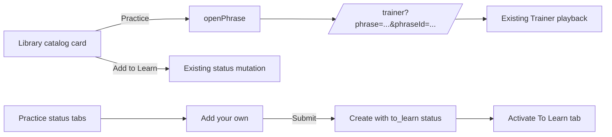

# Library Direct Practice Design

## Flow

`PhraseWorkspace.openPhrase` already creates the canonical Trainer URL. A single `PracticeAction` component invokes it from the shared card summary on both surfaces, keeping navigation separate from `changeStatus`.

The existing custom-phrase form moves from the Library-only branch to the Practice surface outside tab-specific list rendering. Its existing `to_learn` resolution remains the single destination, and a successful submit selects `To Learn` so the new item is immediately visible.

## Interaction hierarchy

- `Practice ↗` is a compact text action in both Library and Practice cards, including mobile layouts.
- `Add to Learn` remains available as a separate non-destructive save action.
- A `To Learn` card names its state action `Move to Learning Now`; the existing `Remove` action remains available.
- `Add your own` is part of Practice rather than Library and stays visible for all three status tabs.

## Constraints

- Phrase text remains sufficient for playback when an anonymous catalog ID is not present in guest storage.
- No client storage, account API, or D1 write occurs before navigation.
