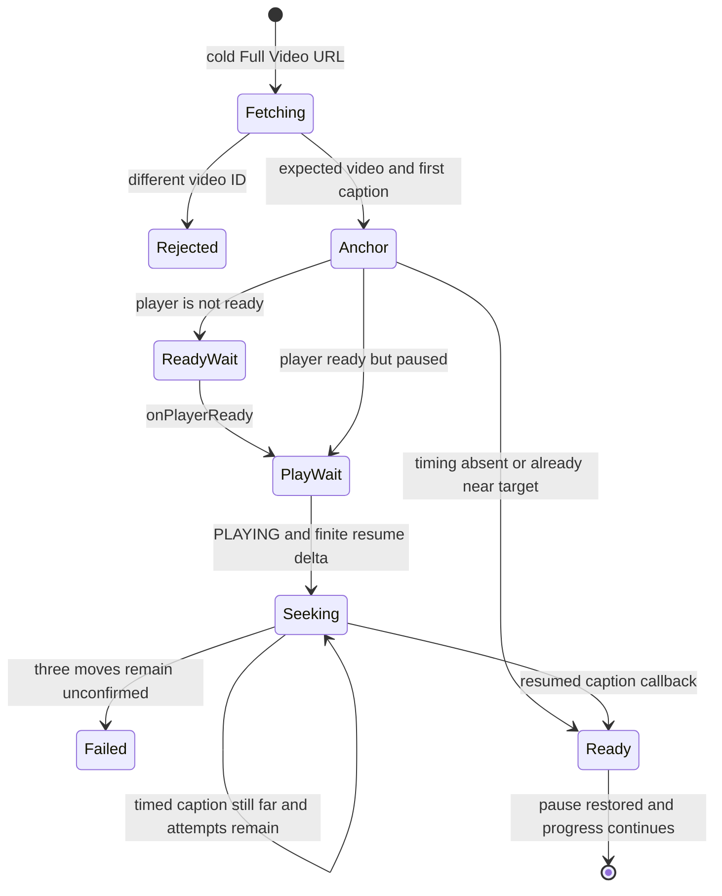

# Stable YouGlish Saved-Video Restore Design

## Architecture Overview

```mermaid
flowchart LR
  Result[YouGlish result caption] --> Extract[Extract marked restoreQuery]
  Extract --> Save[Save video identity]
  Save --> Guest[Guest localStorage]
  Save --> Account[D1 saved_videos]
  Guest --> Videos[/videos]
  Account --> Videos
  Videos --> URL[Trainer URL with restoreQuery and progress]
  URL --> Fetch[fetch restoreQuery plus videoId with saved accent]
  Fetch --> Verify[Verify onVideoChange videoId]
  Verify --> Resume[Confirmed bounded moves to resumeTime]
  Resume --> Player[Full Video Mode]
```

Restore and resume are deliberately separate. A stable provider-derived locator
selects the video; mutable local/account progress selects a later playback point.

## Data Model

Add `restore_query TEXT NOT NULL DEFAULT ''` to `saved_videos` and add
`restoreQuery` to the guest/account public record.

```text
identity: videoId, restoreQuery, language, accent
display context: originPhraseId, originQuery, originCaption
progress: resumeSeconds, resumeCaptionId, resumeCaptionText, progressUpdatedAt
```

New writes require `videoId`, `originQuery`, and `restoreQuery`. Account reads
filter out `restore_query = ''`; guest normalization drops records without a
locator. This intentionally retires legacy records without migration heuristics.
Deduplication remains `(userId, videoId)` / `videoId`, and an upsert refreshes the
locator from the current verified YouGlish result.

## API and URL Contracts

- `POST /api/videos` accepts and validates `restoreQuery` (240 characters).
- `GET /api/videos` returns `restoreQuery` only for new-format rows.
- The one-time legacy-owner account copy includes `restore_query`, so a valid
  new-format record is not downgraded while ownership is transferred.
- `buildFullVideoTrainerUrl` requires `restoreQuery` and emits it as the
  `restoreQuery` search parameter. `query` remains display/phrase context.
- Resume caption ID/text remain optional diagnostics and local navigation state;
  they are never passed to `widget.fetch`.
- Full Video initialization calls
  `widget.fetch(videoSpecificQuery(restoreQuery, videoId), "english", accent)`;
  the accent argument is omitted only for saved `All`.

## Browser Components

- `public/youglish-video-restore.js` owns pure browser helpers for extracting all
  `[[[...]]]` match segments and calculating a safe relative resume delta.
- `public/trainer.html` loads the helper before trainer initialization, captures
  the locator in `currentVideoOrigin`, and shows `Continue in video` only after a
  valid video ID and marked match are both available.
- The warm transition stores/pushes the same `restoreQuery` but does not refetch.
- Cold initialization and Full Video `popstate` both require the new locator.
- The first anchor caption stores its provider timestamp without consuming the
  resume request. Resume waits for `onPlayerReady`; because cold Full Video uses
  `autoStart: 0`, it then requests playback and waits for `PLAYING` before sending
  a relative move. The command remains pending until a later
  `onCaptionChange.current_time` confirms the target within one second. A callback
  still far from the target recalculates the relative delta and permits another
  move, capped at three attempts; player-state noise alone cannot resend it. If
  timing is absent or the delta is negligible, no move is made and normal
  pause/restore behavior continues at the anchor. Resume values retain the
  existing seven-day upper bound before they can become a provider movement.
- Buffering/pause callbacks produced by this controlled startup cannot persist
  anchor progress over the saved target; progress writes resume only after the
  restore has settled. Exhausted retries keep automatic progress blocked for
  that failed session so the known-good saved target is not replaced by the
  phrase anchor.
- `onVideoChange` keeps the existing expected-video guard.

## Resume State Machine



## Design Decisions

- Provider markers are chosen over `originQuery` because they represent the
  actual match returned for that video.
- A schema field is chosen over recomputing the locator later because marker
  information exists only during discovery.
- Relative resume uses documented `widget.move`; direct iframe or YouTube access
  is not introduced.
- A provider command being callable is not treated as proof that the embedded
  player is ready. Resume movement is gated by `onPlayerReady` and `PLAYING` so a
  paused or still-loading widget cannot silently discard the initial command.
- A returned `widget.move` call is not treated as acknowledgement. Only a later
  provider timestamp confirms movement; retries are callback-gated and bounded.
- Missing timing falls back to the stable anchor, not to a text-search retry.
- Legacy rows are filtered/dropped rather than migrated because the missing
  provider marker cannot be reconstructed reliably and the user accepted loss.

## Security, Privacy, and Performance

- Locator/query inputs use existing bounded plain-text normalization; no HTML is
  rendered from them.
- Account reads/writes remain session subject-scoped and guest data remains local.
- The cold path performs one provider fetch and at most three relative moves; no
  extra search retries or transcript requests are added.

## Rollout

- Ship one append-only D1 migration with the empty default required for existing
  tables; do not backfill or infer locator values.
- Deploying the migration before or with application code is safe: old rows stay
  stored but are absent from API results, and guest normalization drops the
  equivalent old local records.
- The deliverable for this lifecycle is a reviewed pull request. Deployment and
  production data mutation are outside the authorized scope.
