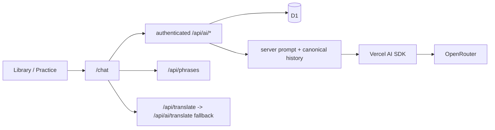

# AI Vocabulary Practice Chat Design

## Delivered Vertical Slice

The feature stays inside the existing React/vinext Cloudflare Worker. A signed-in
learner opens `/chat` directly or launches it from a Library/Practice phrase,
chooses one or several saved and ad-hoc words or phrases, and directs the practice
in natural language. Vercel AI SDK streams the response from the server-selected
OpenRouter model; D1 remains the canonical source for chats, targets, meanings,
messages, retries, and reloads.

Guests may see the sign-in boundary, but `/api/ai/*` is account-only.

## State and API Contracts

- `phrase_meanings` stores user-owned meanings without changing
  `phrase_progress.status`.
- `ai_chats`, `ai_chat_practice_items`, and `ai_chat_messages` persist owned chats,
  the current practice set, ordered turns, target snapshots, safe failure codes,
  and normalized provider/model/token metadata.
- `GET/POST /api/ai/chats` lists or creates chats; `GET /api/ai/chats/:id` restores
  one owned chat.
- `PATCH /api/ai/chats/:id/targets` atomically replaces the complete current
  `targets[]` array. Adding, removing, changing scope, and selecting a meaning all
  use this one contract; there are no target `POST` or `DELETE` routes.
- `POST /api/ai/chats/:id/messages` accepts only `{ clientMessageId, content }`.
  The browser cannot provide authoritative history, targets, model, or system role.
- `GET/POST /api/ai/meanings` lists legacy plus personal meanings or explicitly
  adds a personal meaning.
- Selection translation first uses existing `/api/translate`; its `503`
  unavailable response falls back to authenticated `/api/ai/translate`, which uses
  the same bounded OpenRouter runtime.
- Existing `/api/phrases` remains the only explicit add-to-`To Learn` and manual
  `To Learn` / `Learning Now` / `Learned` status boundary.

## Practice Context

Each saved target supports exactly three scopes:

- `all_saved`: use the legacy translation and all personal meanings;
- `selected`: use one server-validated legacy or personal meaning;
- `explore`: use a meaning outside the known set and explain the distinction.

Ad-hoc targets support `all_saved` or `explore`; they cannot claim a saved meaning.
Several words and phrases can be active together. The prompt deliberately does not
force them into one sentence or define their distribution.

Every generation rebuilds a learner-led system prompt from the current owned
practice set and bounded complete D1 history. Target text is serialized as data,
not instructions. The exact target/meaning snapshot is stored on the user turn, so
a retry remains faithful even after the current targets change.

## Streaming, Retry, and Cancellation

The first write atomically creates a complete user row and a pending assistant row.
The AI SDK response is streamed to the browser and only normalized complete text is
committed to canonical history. Provider error, timeout, request abort, or consumer
cancellation marks the pending assistant retryable with a stable code. Terminal
callbacks are idempotent. A duplicate client id never creates a second user turn.

A fresh pending turn is single-flight. A pending assistant older than the 30-second
lease (20-second provider timeout plus 10 seconds) is recovered as
`provider_timeout` when the chat is opened or the turn is retried. Completion and
failure writes compare the attempt's pending timestamp, so a late callback from a
recovered attempt cannot finish or fail the newer attempt. Retrying an older turn
builds model history only from messages before that turn, preserving chronology.

## Interactive Learning Loop

Assistant output is rendered as plain React text. English words are clickable and
a phrase selection must remain inside one message. The learner can translate the
selection, add it to `To Learn`, attach it as a new meaning to an existing saved
item, or manually change a saved target's status. None of these mutations is
performed by the model. Selection offsets identify the actual occurrence of a
repeated phrase, and asynchronous translations are accepted only for the same text
and context that initiated them.

## Safety Limits

The implemented server limits are: 16,384 request bytes; 12 targets; 240 characters
per target; 500 translation-selection characters; 12 meanings per target; 1,000
characters per stored meaning or context; 100/160 characters per meaning/context in
the model target payload; 48,000 characters for all serialized target data; 4,000
characters per user message; 40 history messages within 32,000 characters; 800
output tokens; and a 20-second upstream timeout.

All mutations require exact same-origin requests. Every D1 operation is owner
scoped. Model output is never trusted HTML. Credentials, prompts, messages, and
upstream bodies are excluded from public errors and must not be logged.

## Deferred

Guest-funded AI, production model/fallback policy, autonomous agent tools,
automatic progress, resumable background streams, final multi-target UX, chat
rename/delete, and retention remain outside this slice.
