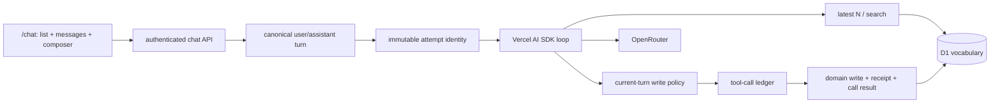

# AI Vocabulary Practice Chat Design

## Architecture

The feature stays in the existing React/vinext Cloudflare Worker. The browser is a
minimal chat client; the Worker owns identity, history, prompt, tools, OpenRouter
runtime, and D1 persistence.

Guests may render the sign-in boundary; generation and tools remain account-only.

## Chat-only Browser Contract

- `GET/POST /api/ai/chats` lists or creates owned chats.
- `GET /api/ai/chats/:id` restores an owned chat.
- `POST /api/ai/chats/:id/messages` accepts only
  `{ clientMessageId, content }` and streams the assistant response.
- The browser cannot submit identity, history, roles, targets, model, tool names,
  arguments, results, receipts, or attempts.
- Account storage and list output are capped at 100 chats. Detail returns the
  latest 200 stored messages in ascending sequence order. The public detail mapper
  removes per-turn practice snapshots and provider/model/usage fields; attempts,
  ledger calls, and receipts never enter the chat DTO.
- The visible UI contains chat list, `New Chat`, timeline, composer, send/retry, and
  essential states only. Compatibility target/meaning APIs and tables may remain,
  but the UI does not depend on them or preselect vocabulary from Library/Practice.
- Compatibility target replacement is one owner-scoped atomic
  `PATCH /api/ai/chats/:id/targets` containing the complete desired array; there are
  no incremental target `POST`/`DELETE` routes. It accepts up to 12 saved/ad-hoc
  targets with `all_saved`, saved-only `selected`, or `explore` meaning mode.
- `POST /api/ai/translate` is an authenticated, bounded server-side contextual
  translation fallback; the current chat UI does not invoke it.

## Deterministic Opening and Read Tools

`POST /api/ai/chats` calls `listRecent(userId, 5)` before creation. D1 orders active
entries by `phrase_progress.created_at DESC, phrases.id DESC`. The Worker formats a
bounded Russian offer and persists it in the chat-creation batch as complete
assistant sequence 1 with `clientMessageId = opening:<chatId>`. No synthetic user
message, assistant attempt, tool ledger row, or provider call is created. When this
message later enters model history, the service escapes delimiter-like characters
and wraps it in `BEGIN/END_UNTRUSTED_VOCABULARY_OPENING` markers; the persisted UI
copy remains readable.

The model later receives two read tools:

- `get_recent_vocabulary({ limit? })`: default 5, integer range 1–10;
- `find_vocabulary({ query, limit? })`: default/maximum 10; owner-scoped substring
  search over phrase text, legacy translation, and the current learner's personal
  translations, with exact matches first, then recency and phrase-ID tie-breaker.
  Query text is capped at 48 characters and its escaped wildcard `LIKE` pattern at
  50 UTF-8 bytes.

Both read only active account-visible vocabulary (`to_learn`, `learning_now`,
`learnt`, plus the stored legacy `learned` alias). Each provider-facing entry is
bounded to 240 text characters and six meanings of 100/160 translation/context
characters. The whole success result is at most 7,800 JSON characters: excess
meanings are removed first, then meaning contexts are blanked if needed, with
`meaningsTruncated` and `detailsTruncated` preserving honest metadata.

The authenticated meaning-list endpoint separately returns at most 50 personal
meanings plus an optional legacy meaning. Its `meaningCount` is the full visible
total and `meaningsTruncated` discloses any omitted personal meanings.

## Write Tools and Authorization

The model has `add_vocabulary_entry`, `add_vocabulary_meaning`, and
`update_vocabulary_meaning`. Their JSON Schemas reject extra properties and omit
identity/status. Handlers bind the authenticated user and exact persisted current
user message.

A write passes only when that current message contains a recognized direct
vocabulary-write command and literally includes every value to persist. Meaning
writes additionally resolve the entry server-side and require its text literally
in the same message. Prior turns and model-generated values never authorize a
write. Denials become bounded tool results, so the assistant can ask for a precise
command.

An update also requires the resolved current translation literally in the current
message. The planner captures phrase/meaning IDs plus old translation/context and
executes an owner-scoped compare-and-swap. A wrong owner, entry, meaning, old value,
or concurrent edit fails the postcondition/conflict guard and becomes a traced
`mutation_conflict`.

There is no status tool. Mutation plans can initialize a new/`pick` entry as
`to_learn`, but preserve every active status. Preset legacy fields are never
updated. Every new supplied translation, including the first translation for a new
custom entry, is written to owner-scoped `phrase_meanings`; new writes never seed
`phrases.translation`. Historical owner-custom legacy fields remain readable through
a phrase-scoped legacy meaning ID. An authorized CAS update promotes that value to
a personal meaning and clears the old fields in the same guarded batch. Preset
legacy meanings still cannot be updated.

The existing manual phrase `PATCH` remains outside the agent tool boundary. For a
preset phrase with no stored translation, it saves the resolved translation as the
current learner's personal meaning and commits that meaning with the requested
status change in one D1 batch; shared preset fields remain immutable.

## Attempts, Ledger, and Receipts

`ai_chat_assistant_attempts` separates a logical assistant message from each
generation run. Attempt ID and number are never reused; terminal attempts remain as
history. Migration 0019 repairs historical duplicate pending attempts and adds a
partial unique index on `chat_id`, allowing only one `pending` attempt across a
chat. The 30-second lease expires abandoned work; a fresh second turn returns
`turn_in_progress`. Finish/fail/tool SQL is fenced by the exact current attempt with
both `status = pending` and an unexpired
`lease_expires_at`. The same lease predicate protects assistant terminal writes,
tool registration/completion, receipt insertion, commit, and replay.

`ai_chat_tool_calls` records every within-budget invocation before execution,
including reads and rejections. A provider-adapter counter rejects the third and
later calls with `tool_budget_exceeded` before reaching the trace executor, so they
consume no D1 trace queries. The identity
`(assistant_attempt_id, provider_tool_call_id)` is unique; canonical argument JSON
and SHA-256 detect conflicting ID reuse. Terminal states are `succeeded`,
`committed`, `replayed`, `rejected`, or `failed`.

`ai_chat_tool_mutation_receipts` is the cross-attempt idempotency boundary. Its
unique key is `(user_message_id, operation, target_key)`. Operations are versioned
domain names; entry targets use normalized text, while meaning updates use the
owned meaning ID. Equal canonical-argument hashes replay the stored bounded result;
different hashes return `mutation_conflict`.

Entry `target_key` normalization mirrors SQLite `NOCASE`: NFKC and whitespace
cleanup followed by ASCII `A-Z` folding only. This aligns receipt identity with the
database unique index; non-ASCII case variants intentionally remain distinct.

For a write, D1 executes domain statements, a postcondition-guarded receipt insert,
and the tool-call `committed` update in one `batch`. A false owner/status/entity
postcondition aborts the batch. Concurrent equivalent writes converge on one
receipt; an ambiguous error after commit is resolved by reading that receipt. A
batch error is not retried blindly: readback first recovers a matching receipt,
then detects an inactive/stale attempt, then classifies a proven CAS conflict. If
none is observed, the ledger call ends with `operation_failed`.

## Turn and Retry Flow

1. `beginTurn` batches the complete user row, its bounded immutable
   practice snapshot (at most 48,000 JSON characters), pending assistant row,
   attempt 1, and chat timestamp.
2. The service rebuilds bounded canonical history only before this user sequence,
   creates the tool executor with user/chat/message/attempt IDs, and starts a
   maximum five-step AI SDK loop.
3. Each tool call is registered and fenced before execution. The hard per-turn
   budget is two calls. A pre-trace adapter fence rejects call three onward without
   D1 trace work, leaving room under D1 Free's 50-query invocation limit. Counting
   each batch statement, measured envelopes are 34 for two maximum reads, 42 for
   two cold worst-case writes, 44 with one ambiguous committed write, 45 for a
   fully rolled-back mutation, and 47 for rollback followed by ambiguous commit.
   Maximum-size create-chat ambiguous recovery uses 49/50. Tools are disabled for
   the final model step.
4. Final text/usage completes only the current attempt and assistant row. Error,
   abort, cancellation, or timeout fails only that current attempt.
5. Retry retains the same user, practice snapshot, and assistant message, expires
   any stale pending attempt, inserts the next attempt number, and replays matching
   durable receipts. Later target changes cannot rewrite an older turn's context.

Turn and retry IDs are allocated before their D1 batches. If a batch response is
ambiguous after commit, readback accepts only those exact fresh user/assistant and
attempt IDs as the operation's own result (`created`/`retrying`), allowing the
service to continue generation rather than return a false conflict.

The provider timeout is 20 seconds and the pending lease is 30 seconds. Complete or
fresh-pending duplicate client turns return conflict/existing state rather than
starting another paid request; reuse with different user content is rejected. A
fresh pending attempt for any other turn in the same chat is also rejected.

Provider stream data passes through a public allowlist: start, remapped text
start/delta/end, sanitized finish, stable error, and abort. Tool, reasoning, source,
file, custom, step, raw, request, warning, and provider metadata chunks are dropped.
Provider 429 maps to `provider_rate_limited`; other upstream failures expose only
stable public codes.

## Limits and Privacy

Existing chat ceilings remain: 16,384 request bytes; 4,000 message characters;
100 chats per account/list response; latest 200 messages per detail; 40 complete
model-history messages/32,000 characters; 800 output tokens; 20-second provider
timeout. Vocabulary limits are 10 read entries, 240 entry characters,
1,000 meaning/context characters, and six bounded provider meanings per entry. A
successful compact read result is capped at 7,800 JSON characters. Practice target
data is capped at 12 targets/48,000 characters. Tool trace JSON is limited to 4,096
argument and 8,192 result characters; provider call ID/tool name are limited to
240/120 characters.

Every mutation requires exact origin; every D1 operation is owner scoped. Stored
vocabulary is untrusted prompt data, assistant output is plain text, and public
errors/logging exclude secrets, prompts, messages, vocabulary, tool arguments,
results, and upstream bodies.

## Duplicate Migration Contract

Migration 0017 chooses the earliest owner-custom phrase under SQLite ASCII
`NOCASE` as canonical, merges historical duplicates, and then creates the partial
unique index. It preserves/rehomes progress, personal meanings, examples, saved
video origins, and chat practice-item phrase/selected-meaning references; duplicate
meaning/example rows converge deterministically. Before duplicate meanings are
deleted, the canonical meaning preserves their non-empty translation/context and
latest `updated_at`. Unicode case variants stay separate by explicit contract.

Preview already executed an older 0017 body, so its schema history does not prove
the corrected migration path. Preview must be re-baselined or an equivalent forward
migration explicitly accepted; migration 0019 is not claimed as preview-applied.

## Authentication Migration Boundary

`ensureUser` is the normal one-statement user upsert. The historical legacy-owner
transfer is a separate atomic, idempotent operation invoked during `/login` and
`/api/session`, including existing-session bootstrap, never inside an AI generation
request.

## Open Decisions

- Whether re-activation should change recency; today `created_at` defines latest.
- Final target/meaning controls, interactive translation, and cross-surface launch.
- Intent languages and whether deterministic write authorization should evolve
  beyond the current Russian/English command recognizer.
- Production model/routing, spend/rate policy, guest access, retention, monitoring
  thresholds, and resumable/background execution.
