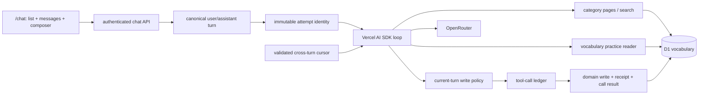

# AI Vocabulary Practice Chat Design

## Architecture

The feature stays in the existing React/vinext Cloudflare Worker. The browser is a
minimal chat client; the Worker owns identity, history, prompt, tools, OpenRouter
runtime, and D1 persistence.

Guests may render the sign-in boundary; generation and tools remain account-only.

## Chat-only Browser Contract

- `GET/POST /api/ai/chats` lists or creates owned chats.
- `GET /api/ai/chats/:id` restores an owned chat.
- `POST /api/ai/chats/:id/messages` accepts only
  `{ clientMessageId, content }` and streams the assistant response.
- The browser cannot submit identity, history, roles, targets, model, tool names,
  arguments, results, receipts, or attempts.
- Account storage and list output are capped at 100 chats. Detail returns the
  latest 200 stored messages in ascending sequence order. The public detail mapper
  removes per-turn practice snapshots and provider/model/usage fields; attempts,
  ledger calls, and receipts never enter the chat DTO.
- The visible UI contains chat list, `New Chat`, timeline, composer, send/retry, and
  essential states only. Compatibility target/meaning APIs and tables may remain,
  but the UI does not depend on them or preselect vocabulary from Library/Practice.
- Compatibility target replacement is one owner-scoped atomic
  `PATCH /api/ai/chats/:id/targets` containing the complete desired array; there are
  no incremental target `POST`/`DELETE` routes. It accepts up to 12 saved/ad-hoc
  targets with `all_saved`, saved-only `selected`, or `explore` meaning mode.
- There is no separate AI-translation route. The existing DeepL-backed
  `/api/translate` remains a trainer capability; any future chat-selection
  translation must reuse the traced AI runner rather than add an unmetered provider
  path.

## Vocabulary Boundary

`lib/vocabulary/practice-reader.ts` owns vocabulary-specific resolution of saved
practice targets and the current practice-item projection. It validates account-
visible phrases and owner-scoped selected meanings, then returns domain drafts/items
to the chat repository. `lib/ai-chat/repository.ts` retains chat ownership checks,
target validation for meaning mode/ad-hoc input, ordered resolution, and atomic chat
persistence. This keeps vocabulary SQL out of the chat persistence module without
adding extra ownership queries or changing the measured D1 envelopes.

The AI-tool package follows the same boundary internally:

- `tools/vocabulary/contracts.ts` owns names and types;
- `policy.ts` owns deterministic current-turn authorization;
- `results.ts` owns bounded provider output;
- `handlers.ts` orchestrates domain reads/plans;
- `registry.ts` owns the six AI SDK schemas and one traced budget wrapper;
- `pagination.ts` owns opaque cursor encoding/validation and continuation parsing.

`lib/ai-chat/vocabulary-tools.ts` only re-exports this API as a thin compatibility
facade. This keeps parsing, transport, persistence, and provider registration from
collapsing back into one module.

## Deterministic Opening and Read Tools

`POST /api/ai/chats` calls `listRecent(userId, 5)` before creation. D1 orders active
entries by `julianday(phrase_progress.created_at) DESC, phrases.id DESC`, so legacy
SQLite timestamps and ISO timestamps share one chronological order. Pagination
keeps the selected row's raw SQLite/ISO-seconds/ISO-milliseconds timestamp in the
opaque boundary and compares it through `julianday`. The Worker formats a bounded
Russian offer and persists it in the chat-creation batch as complete assistant
sequence 1 with `clientMessageId = opening:<chatId>`. No synthetic user message,
assistant attempt, tool ledger row, or provider call is created. When this message
later enters model history, the service escapes delimiter-like characters and wraps
it in `BEGIN/END_UNTRUSTED_VOCABULARY_OPENING` markers; the persisted UI copy
remains readable.

The model later receives two read tools:

- `list_vocabulary({ category?, limit?, cursor? })`: page size 1–10 (default 5),
  categories `all`, `to_learn`, `learning`, and `learned`, newest first. It has no
  overall entry limit: a versioned opaque cursor advances only the same category;
- `find_vocabulary({ query, limit? })`: default/maximum 10; owner-scoped substring
  search over phrase text, legacy translation, and the current learner's personal
  translations, with exact matches first, then recency and phrase-ID tie-breaker.
  Query text is capped at 48 characters and its escaped wildcard `LIKE` pattern at
  50 UTF-8 bytes.

Both read only account-visible vocabulary. The public category mapping is
`to_learn -> to_learn`, `learning_now -> learning`, and `learnt|learned -> learned`.
Each provider-facing entry is
bounded to 240 text characters and six meanings of 100/160 translation/context
characters. The whole success result is at most 7,800 JSON characters: excess
meanings are removed first, then meaning contexts are blanked if needed, with
`meaningsTruncated` and `detailsTruncated` preserving honest metadata.

The authenticated meaning-list endpoint separately returns at most 50 personal
meanings plus an optional legacy meaning. Its `meaningCount` is the full visible
total and `meaningsTruncated` discloses any omitted personal meanings.

After a completed `list_vocabulary` call, its ledger result is the continuation
source. Before the next user sequence, the service reads the latest earlier result
and accepts only `ok + hasMore + category + valid nextCursor`. Only `{ category,
cursor }` enters the next prompt; prior entries do not. The prompt tells the model
to reuse it only when the learner asks to continue that same listing. This makes
full traversal possible across turns while preserving the two-call per-turn budget.

## Versioned Prompt Contract

The prompt is isolated at `lib/ai-chat/prompts/vocabulary-practice.ts` with stable
ID `unmumble.vocabulary-practice` and version `1`. Its contract is learner-led,
plain-text, treats openings/targets/tool results as untrusted data, forbids inferred
writes or autonomous category changes, and carries only a validated list cursor for
continuation. The service passes prompt ID/version into privacy-safe lifecycle
events; prompt text itself is never logged.

## Write Tools and Authorization

The model has four writes: `add_vocabulary_entry`, `add_vocabulary_meaning`,
`update_vocabulary_meaning`, and `set_vocabulary_category`. Together with the two
reads this is an exact six-tool registry. JSON Schemas reject extra properties and
omit identity/raw stored status. Handlers bind the authenticated user and exact
persisted current user message.

A write passes only when that current message contains a recognized direct
vocabulary-write command and literally includes every value to persist. Meaning
writes additionally resolve the entry server-side and require its text literally
in the same message. Prior turns and model-generated values never authorize a
write. Denials become bounded tool results, so the assistant can ask for a precise
command.

Command recognition may ignore case, but persisted-value authorization does not:
literal matching uses NFC and preserves case and compatibility characters, so
`Polish` cannot authorize `polish` and full-width text cannot authorize ASCII.
Revocation is recognized only as leading command language or punctuation-delimited
trailing language; a literal value such as `never mind` remains saveable. Unquoted
terminal punctuation is treated as command punctuation, while matching quotes make
it part of the literal (`"wow!"` differs from `wow`).

An update also requires the resolved current translation literally in the current
message. The planner captures phrase/meaning IDs plus old translation/context and
executes an owner-scoped compare-and-swap. A wrong owner, entry, meaning, old value,
or concurrent edit fails the postcondition/conflict guard and becomes a traced
`mutation_conflict`.

`set_vocabulary_category` accepts only `to_learn`, `learning`, or `learned` and
requires the current message to literally name the resolved entry and matching
destination. It never infers mastery from practice or prior turns. The mutation
planner compare-and-swaps the owner-scoped current stored status, mapping public
categories to the existing D1 status vocabulary. Other mutation plans initialize a
new/`pick` entry as `to_learn` but preserve active status. Preset legacy fields are
never updated; translations remain owner-scoped personal meanings, including
promotion of authorized owner-custom legacy values.

The existing manual phrase `PATCH` remains outside the agent tool boundary. For a
preset phrase with no stored translation, it saves the resolved translation as the
current learner's personal meaning and commits that meaning with the requested
status change in one D1 batch; shared preset fields remain immutable.

## Attempts, Ledger, and Receipts

`ai_chat_assistant_attempts` separates a logical assistant message from each
generation run. Attempt ID and number are never reused; terminal attempts remain as
history. Migration 0019 repairs historical duplicate pending attempts and adds a
partial unique index on `chat_id`, allowing only one `pending` attempt across a
chat. Migration 0020 stores the configured provider/model on the attempt before
generation, independently from terminal provider/model and sanitized routed-provider
telemetry. The 30-second lease expires abandoned work; a fresh second turn returns
`turn_in_progress`. Finish/fail/tool SQL is fenced by the exact current attempt with
both `status = pending` and an unexpired
`lease_expires_at`. The same lease predicate protects assistant terminal writes,
tool registration/completion, receipt insertion, commit, and replay.

`ai_chat_tool_calls` records every within-budget invocation before execution,
including reads and rejections. A provider-adapter counter rejects the third and
later calls with `tool_budget_exceeded` before reaching the trace executor, so they
consume no D1 trace queries. The identity
`(assistant_attempt_id, provider_tool_call_id)` is unique; canonical argument JSON
and SHA-256 detect conflicting ID reuse. Terminal states are `succeeded`,
`committed`, `replayed`, `rejected`, or `failed`.

The registry serializes provider tool calls from the same model step through one
execution queue before applying the shared call counter and mutation circuit. If a
mutation returns any bounded failure or throws, the circuit opens and every later
queued provider tool call in that model turn returns `tool_budget_exceeded` before
the traced executor. A failed mutation can therefore consume its recovery envelope,
but even provider calls issued concurrently cannot trigger a second tool-side D1
call in the same turn.

`ai_chat_tool_mutation_receipts` is the cross-attempt idempotency boundary. Its
unique key is `(user_message_id, operation, target_key)`. Operations are versioned
domain names; entry targets use normalized text, while meaning updates use the
owned meaning ID. Equal canonical-argument hashes replay the stored bounded result;
different hashes return `mutation_conflict`.

Write policy, persistence, and canonical arguments keep the learner's NFC literal
and do not compatibility-fold it. Entry `target_key` normalization mirrors SQLite
`NOCASE`: NFC and whitespace cleanup followed by ASCII `A-Z` folding only. This
aligns receipt identity with the database unique index; full-width/other
compatibility forms and non-ASCII case variants intentionally remain distinct.

For a write, D1 executes domain statements, a postcondition-guarded receipt insert,
and the tool-call `committed` update in one `batch`. A false owner/status/entity
postcondition aborts the batch. Concurrent equivalent writes converge on one
receipt; an ambiguous error after commit is resolved by reading that receipt. A
batch error is not retried blindly: readback first recovers a matching receipt,
then detects an inactive/stale attempt, then classifies a proven CAS conflict. If
none is observed, the ledger call ends with `operation_failed`.

## Turn and Retry Flow

1. `beginTurn` batches the complete user row, its bounded immutable
   practice snapshot (at most 48,000 JSON characters), pending assistant row,
   attempt 1, and chat timestamp.
2. The service rebuilds bounded canonical history only before this user sequence,
   restores at most one validated continuation from the latest earlier completed
   `list_vocabulary` ledger result, builds prompt ID/version
   `unmumble.vocabulary-practice`/`1`, creates the tool executor with
   user/chat/message/attempt IDs, and
   starts a maximum five-step AI SDK loop.
3. Each tool call is registered and fenced before execution. The hard per-turn
   budget is two calls. A pre-trace adapter fence rejects call three onward without
   D1 trace work; same-step calls are serialized, and a failed/thrown mutation opens
   the earlier circuit before any later queued provider tool call. Counting each
   batch statement, current generation envelopes
   are 35 for two maximum reads, 43 for two cold writes, 45 with one ambiguous
   committed write, 36 for rollback/circuit, 38 for rollback plus ambiguous
   terminal failure, and 41 for legacy-promotion rollback plus ambiguous terminal
   failure. The same legacy rollback issued concurrently with a duplicate write
   also remains 41 because the duplicate is rejected without D1. Maximum-size
   create-chat ambiguous recovery remains 49/50. Tools are disabled for the final
   model step.
4. Final text/usage completes only the current attempt and assistant row. Both
   `finishTurn` and `failTurn` start from owner-scoped `findTurn`, avoiding a
   redundant ownership query. A normal successful terminal batch returns locally
   constructed terminal state without another read. Error, abort, cancellation, or
   timeout fails only that current attempt; exact readback is used only after an
   ambiguous D1 response or failed postcondition, and accepts only this attempt's
   own committed terminal state.
5. Retry retains the same user, practice snapshot, and assistant message, expires
   any stale pending attempt, inserts the next attempt number, and replays matching
   durable receipts. Later target changes cannot rewrite an older turn's context.

Turn and retry IDs are allocated before their D1 batches. If a batch response is
ambiguous after commit, readback accepts only those exact fresh user/assistant and
attempt IDs as the operation's own result (`created`/`retrying`), allowing the
service to continue generation rather than return a false conflict.

The provider timeout is 20 seconds and the pending lease is 30 seconds. Complete or
fresh-pending duplicate client turns return conflict/existing state rather than
starting another paid request; reuse with different user content is rejected. A
fresh pending attempt for any other turn in the same chat is also rejected.

Provider stream data passes through a public allowlist: start, remapped text
start/delta/end, sanitized finish, stable error, and abort. Tool, reasoning, source,
file, custom, step, raw, request, warning, and provider metadata chunks are dropped.
Provider 429 maps to `provider_rate_limited`; other upstream failures expose only
stable public codes.

## Provider, Abuse, and Operational Boundary

Runtime configuration is valid only when it names the code-owned concrete model
`deepseek/deepseek-v4-flash-0731`; presets and unlisted models fail closed as
`not_configured`. Each request disables OpenRouter plugins and sets
`data_collection: deny`, ZDR, and `require_parameters: true` so an endpoint must
support every sent parameter, including local function tools. The generation layer
supplies local vocabulary tools explicitly, and an outbound serialization test
verifies that those local tools remain while no preset or fallback-model fields
reach OpenRouter.

There is no runtime preset dependency. Removing the preset also removes its
OpenRouter response-cache configuration; requests explicitly disable provider
plugins. DeepSeek prompt-prefix caching is a separate provider behavior and remains
automatic without an application or preset setting.

Before turn creation or provider work, Cloudflare rate-limit bindings enforce 10
generation requests per authenticated account per minute and an aggregate 100 per
Cloudflare location per minute. Missing/erroring bindings fail closed with a safe
503; a denied counter returns the stable 429 `provider_rate_limited` code. The
location-local, eventually consistent counters are approximate edge abuse guards,
not globally atomic or exact spend accounting.

The service emits only four allowlisted structured events: generation started,
completed, failed, and rate-limit rejected. Generation events include bounded
attempt, provider/configured-or-actual-model, prompt ID/version, and safe error
identifiers; prompts, messages, vocabulary, tool arguments/results, credentials,
and upstream bodies are excluded.

## Limits and Privacy

Existing chat ceilings remain: 16,384 request bytes; 4,000 message characters;
100 chats per account/list response; latest 200 messages per detail; 40 complete
model-history messages/32,000 characters; 800 output tokens; 20-second provider
timeout. Vocabulary page/search limits are 10 entries per result, 240 entry
characters, 1,000 meaning/context characters, and six bounded provider meanings per
entry. A list has no overall entry cap and advances by a <=512-character opaque
cursor. A successful compact result is capped at 7,800 JSON characters. Practice target
data is capped at 12 targets/48,000 characters. Tool trace JSON is limited to 4,096
argument and 8,192 result characters; provider call ID/tool name are limited to
240/120 characters.

Every mutation requires exact origin; every D1 operation is owner scoped. Stored
vocabulary is untrusted prompt data, assistant output is plain text, and public
errors/logging exclude secrets, prompts, messages, vocabulary, tool arguments,
results, and upstream bodies.

## Local Verification

Fresh exact-diff evidence passes focused backend tests 217/217, full `npm test`
501/501, typecheck, Drizzle validation, dependency audit, lifecycle/diff/secret/
ignore checks, and lint with zero errors plus three existing warnings. Independent
final review found no P0/P1. These close the local architecture/static gates, not
the remaining preview or production rollout gates.

## Duplicate Migration Contract

Migration 0017 chooses the earliest owner-custom phrase under SQLite ASCII
`NOCASE` as canonical, merges historical duplicates, and then creates the partial
unique index. It preserves/rehomes progress, personal meanings, examples, saved
video origins, and chat practice-item phrase/selected-meaning references; duplicate
meaning/example rows converge deterministically. Before duplicate meanings are
deleted, the canonical meaning preserves their non-empty translation/context and
latest `updated_at`. Unicode case variants stay separate by explicit contract.

Preview already executed an older 0017 body, but commit `c970f80` documents the
read-only preflight that found zero owner-custom ASCII-`NOCASE` duplicates before
that deployment. The corrected merge therefore had no rows to transform, and this
preview is explicitly accepted as behaviorally equivalent: no 0017 re-baseline or
forward migration is needed there. Fresh production will execute the corrected
0017. Read-only preview evidence also confirms 0019 applied, its one-pending-
attempt-per-chat index present, and `PRAGMA foreign_key_check` clean; 0020 is the
only pending preview migration.

## Authentication Migration Boundary

`ensureUser` is the normal one-statement user upsert. The historical legacy-owner
transfer is a separate atomic, idempotent operation invoked during `/login` and
`/api/session`, including existing-session bootstrap, never inside an AI generation
request.

## Open Decisions

- Whether re-activation should change recency; today `created_at` defines latest.
- Final target/meaning controls, interactive translation, and cross-surface launch.
- Intent languages and whether deterministic write authorization should evolve
  beyond the current Russian/English command recognizer.
- Model-allowlist governance, future fallback models, spend ownership, guest access,
  retention, monitoring thresholds, deployment, and resumable/background execution.
