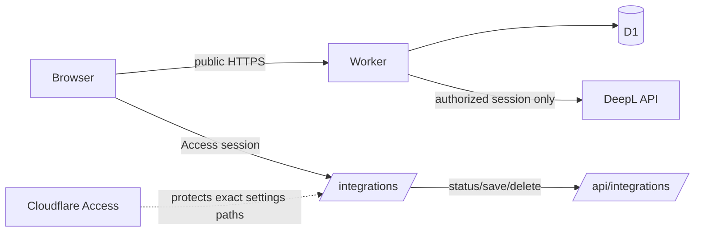

# System Design & Architecture

## Architecture Overview

The app is a Vinext/React frontend and Cloudflare Worker backed by D1. Cloudflare Access protects only the settings paths; the trainer stays public. The worker creates a short-lived signed HttpOnly session cookie after Access authentication.

## Data model and APIs

- `integration_secrets(provider, ciphertext, iv, created_at, updated_at)` stores AES-GCM ciphertext and a random IV. The master key is the Worker Secret `INTEGRATIONS_ENCRYPTION_KEY`.
- `GET /api/integrations` returns provider status and may issue the session cookie; it never returns a key.
- `POST /api/integrations` accepts `{ provider: "deepl", key }`, validates same-origin and body size, then encrypts the key.
- `DELETE /api/integrations?provider=deepl` removes the D1 value.
- DeepL requests require the signed session, so a public visitor cannot spend the configured key.

## Design decisions

- D1 is used instead of client storage or plaintext configuration so the browser never receives the key.
- Access is path-scoped rather than Worker-wide, preserving the public trainer.
- Translation is best-effort. Storage and phrase progression do not depend on DeepL availability.
- AES-GCM uses provider-bound additional authenticated data; the session uses HMAC-SHA-256.

## Non-functional requirements

No paid Cloudflare service is required for the current design. Responses from the settings API are `no-store`; secrets are not logged or returned.
